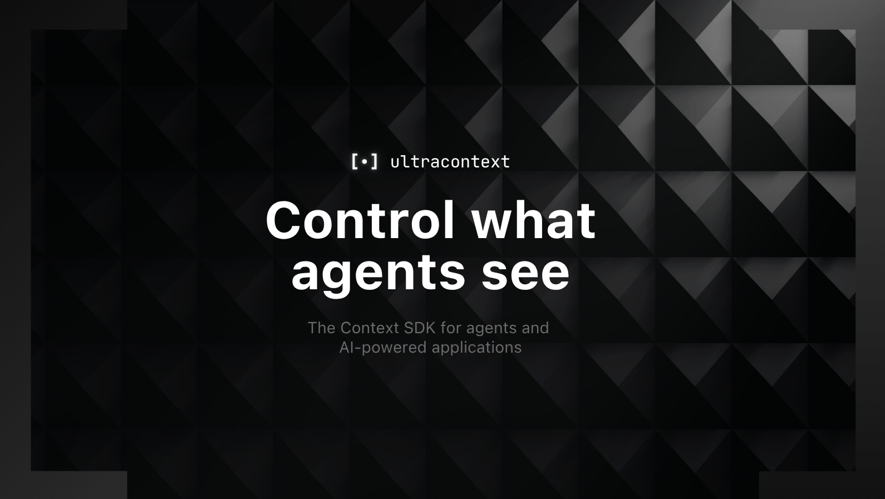

<div align="center">
  <a href="https://github.com/ultracontext/ultracontext">
    
  </a>
</div>

<div align="center">
  <h1>ultracontext</h1>

  <a href="https://github.com/ultracontext/ultracontext/tree/main/docs"></a>
  <a href="https://www.npmjs.com/package/ultracontext"></a>
  <a href="https://pypi.org/project/ultracontext/"></a>
  <a href="https://github.com/ultracontext/ultracontext/blob/main/LICENSE"></a>
</div>

ultracontext is a context SDK for AI. You get SQL-backed storage for sessions, context windows, and artifacts. Everything is auto-versioned, searchable, and mountable as a filesystem, across local, server, and edge. A Rust core with thin JavaScript and Python SDKs.

## Why

Databases and storage weren't built for AI. If we want to keep pushing the boundaries, we have to treat sessions, context windows, and artifacts as first-class citizens, not afterthoughts.

## Install

```bash
curl -fsSL https://raw.githubusercontent.com/ultracontext/ultracontext/main/install.sh | bash
```

## Getting started

From your project folder:

```bash
uc init
```

Store a session and build context:

```ts
import { createClient } from 'ultracontext/local'
const uc = createClient()

// Open a session
const session = await uc.sessions.create() // v0

// Append messages (schemaless). Appending doesn't fork the window — still v0.
await session.context.append({ role: 'user', content: '...' })
await session.context.append({ role: 'assistant', content: '...' })
```

## Edit anything, lose nothing

```ts
import { createClient } from 'ultracontext/local'
const uc = createClient()

const session = await uc.sessions.create() // v0
await session.context.append({ role: 'user', content: '...' })
await session.context.append({ role: 'assistant', content: '...' })

// You edit a message. The old window doesn't vanish — it's saved as v1.
await session.context.update({ index: 0, content: 'New system prompt' })

// Go back to the prompt before you touched it, or fork a branch from any point.
const { data } = await session.context.get({ version: 0 })
const branch = await session.fork({ version: 1 })

// Use the messages with any LLM framework or agent SDK.
const response = await generateText({ model, messages: data })
```

## Recover context pre-compaction

Time-travel and Spin off a subagent to inspecto the context window before compaction to get specific implementation details you had layed out before compaction. 

```ts
import { createClient } from 'ultracontext/local'
const uc = createClient()

const session = await uc.sessions.get('ses_main')

// The agent compacted its window. The full context is still here — pull it back.
const { data: full } = await session.context.get({ version: 7 })

// Hand it to a fresh subagent to investigate, without touching the main session.
const subagent = await uc.sessions.create({ metadata: { parent: session.id } })
await subagent.context.append([
  ...full,
  { role: 'user', content: 'What caused the regression?' }
])
const finding = await generateText({ model, messages: (await subagent.context.get()).data })
```

## Same context, everywhere

Everything lives in one place, so you can query any session's context on demand from single source of truth anywhere you need. For example, parallel subagents can get each others context in realtime as they work.

```ts
import { createClient } from 'ultracontext/local'
const uc = createClient()

// Two subagents work the same task in parallel, each in its own session.
const a = await uc.sessions.create({ metadata: { role: 'subagent' } })
const b = await uc.sessions.create({ metadata: { role: 'subagent' } })

// Mid-flight, B reads what A has figured out so far — live, straight from the store.
const { data: fromA } = await a.context.get()

// B builds on it instead of redoing the work.
await b.context.append([
  ...fromA,
  { role: 'user', content: 'Continue from what the other agent already found.' }
])
const response = await generateText({ model, messages: (await b.context.get()).data })
```

## Offload to artifacts

Artifacts are the files models produce — plans, code, images, markdown. They live in the workspace and version themselves, so an overwritten file is never lost. Offloading bulky output to artifacts keeps context windows lean and models sharp.

```ts
import { createClient } from 'ultracontext/local'
const uc = createClient()

const session = await uc.sessions.create()
await session.context.append({ role: 'user', content: 'Generate a launch plan' })

// Save the model's output as an artifact. Edit it later and it versions itself.
const response = await generateText({ model, messages: data })
const artifact = await session.artifacts.create({ path: 'plans/launch.md', data: response.text })
```

Better still, give the model the tools and let it read and write artifacts itself through `session.artifacts.*` (`create`, `update`, ...) — or mount the workspace and let it use real files.

## Portable filesystem

ultracontext projects workspace artifacts into a portable filesystem. Mount it, and agents or editors work with real files — every change flows back into storage, auto-versioned.

```bash
uc mount ./UltraContext
```

Now your workspace is just folders and files:

```text
UltraContext/
├── artifacts/
│   ├── launch.md
│   ├── architecture.png
│   └── benchmarks.csv
├── skills/
│   ├── code-review/
│   │   └── SKILL.md
│   └── summarize/
│       └── SKILL.md
└── plans/
    ├── roadmap.md
    └── auth-migration.md
```

No disk? Reach the same files over the API — `read`, `write`, `grep`, `glob` — anywhere, including the edge.

```ts
await session.fs.write('plans/launch.md', '# Launch')
const plan = await session.fs.read('plans/launch.md')
```

Edit those files however you like — an editor, an agent, or the API. Every change is versioned automatically, and storage and mount stay in sync.

## Search

Full-text search across your sessions and text files, in one query.

Give your agents the CLI:

```bash
uc search "launch notes"
```

Or from the SDK:

```ts
await uc.search.query('launch notes')
```

You get back a snippet plus an id — a message in a context, or a file path. Read the full content with a targeted `session.context` or `session.fs` read.

## Under the hood

Everything is a node. Edit one and you get a new version that points back to the last — nothing is overwritten. The newest is the HEAD, what the model sees.

```text
session  ses_4f2e···                  the handle you keep
│
├─ context v0                         older versions, still readable
├─ context v1
└─ context v2  ◄── HEAD                the current window → sent to the model
      ├─ user       "summarize the spec"
      ├─ assistant  "here's a summary…"
      └─ user       "now draft the PR"
```

Workspaces, sessions, contexts, messages, and artifacts — all the same node.

That's the whole engine. It's entirely written in Rust. The full graph is in the [docs](https://github.com/ultracontext/ultracontext/tree/main/docs).

## It belongs to you

Your context is a plain SQLite file. No lock-in, no black box. Its yours.

```bash
sqlite3 .ultracontext/ultracontext.db .tables
```

Host it on Supabase, S3, R2, MinIO, or any Postgres- or S3-compatible provider, and serve the same model over HTTP for server and edge. We plan to eventually build a plug-n-play managed cloud to simplify the deploying experience for this, but that’s not the priority right now.

## License

Apache-2.0
